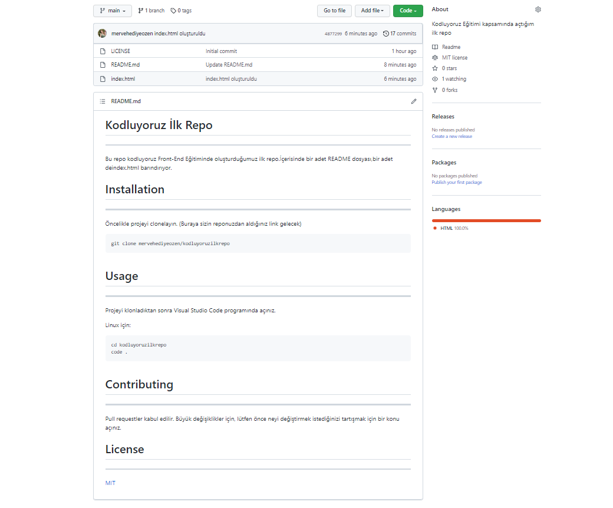

# Kodluyoruz İlk Repo


---

Bu repo kodluyoruz Front-End Eğitiminde oluşturduğumuz ilk repo.İçerisinde bir adet README dosyası,bir adet deindex.html barındırıyor.


# Installation

---

Öncelikle projeyi clonelayın. (Buraya sizin reponuzdan aldığınız link gelecek)
```
git clone mervehediyeozen/kodluyoruzilkrepo
```


# Usage

---

Projeyi klonladıktan sonra Visual Studio Code programında açınız.

Linux için:

```
cd kodluyoruzilkrepo
code .
```


# Contributing

---
